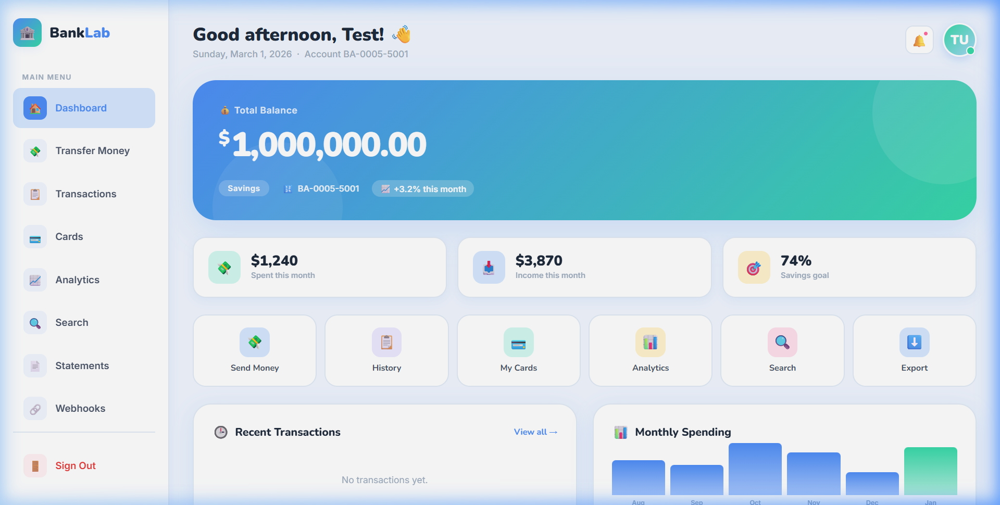

# 🏦 BankLab — Intentionally Vulnerable Banking Application

> **A hands-on penetration testing lab built with PHP & MySQL.**  
> Designed for students and security learners to practice real-world web application attacks in a safe, controlled environment.



---

## 📋 Table of Contents

- [What is BankLab?](#-what-is-banklab)
- [Vulnerabilities Included](#-vulnerabilities-included)
- [Requirements](#-requirements)
- [Setup Guide](#-setup-guide)
- [Test Accounts](#-test-accounts)
- [Attack Surface](#-attack-surface)
- [Disclaimer](#-disclaimer)

---

## 🎯 What is BankLab?

**BankLab** is a realistic, fully functional internet banking web application that is **intentionally vulnerable**. It simulates what a real bank's web portal might look like, complete with:

- ✅ Login & session management
- ✅ Account dashboard with balances & charts
- ✅ Money transfers between accounts
- ✅ Transaction history
- ✅ Credit/Debit card management (Freeze, Unblock, Details)
- ✅ Financial analytics page
- ✅ Profile management
- ✅ Notifications
- ✅ File upload (profile photo)
- ✅ Statement download
- ✅ Export reports
- ✅ Webhook notification settings
- ✅ Search functionality
- ✅ Admin panel
- ✅ REST API (`api.php`)

The application looks and feels **real and professional** — the goal is for students to discover vulnerabilities on their own, just like in real-world penetration testing engagements.

---

## 🔓 Vulnerabilities Included

BankLab contains **19 intentional vulnerabilities** spanning the OWASP Top 10:

| # | Vulnerability | Location | Severity |
|---|--------------|----------|----------|
| 1 | SQL Injection (Auth Bypass) | `login.php` | 🔴 Critical |
| 2 | IDOR (Account Takeover) | `dashboard.php`, `transactions.php` | 🔴 Critical |
| 3 | Stored XSS | `transfer.php` memo field | 🟠 High |
| 4 | Reflected XSS | `search.php?q=` | 🟠 High |
| 5 | CSRF (Silent Transfer) | `transfer.php` | 🟠 High |
| 6 | Unrestricted File Upload / RCE | `upload.php` | 🔴 Critical |
| 7 | Local File Inclusion / Path Traversal | `statements.php?file=` | 🔴 Critical |
| 8 | Command Injection | `export.php` report name | 🔴 Critical |
| 9 | SSRF | `webhook.php` test URL | 🟠 High |
| 10 | Open Redirect | `login.php?redirect=` | 🟡 Medium |
| 11 | Username Enumeration | `login.php` error messages | 🟡 Medium |
| 12 | Broken Access Control (Admin) | `admin.php` | 🔴 Critical |
| 13 | Business Logic Flaw | `transfer.php` negative amounts | 🟠 High |
| 14 | Mass Assignment | `api.php?endpoint=update_profile` | 🔴 Critical |
| 15 | API IDOR | `api.php?endpoint=account&id=N` | 🟠 High |
| 16 | Hardcoded API Keys | `api.php` source | 🟠 High |
| 17 | API SQLi + User Enumeration | `api.php?endpoint=search` | 🟠 High |
| 18 | Insecure CORS | `api.php` | 🟡 Medium |
| 19 | Plaintext Password Storage | `users` table / admin panel | 🔴 Critical |

---

## 🖥️ Requirements

| Component | Version |
|-----------|---------|
| **XAMPP** | 8.x or later |
| **PHP** | 8.0+ |
| **MySQL** | 5.7+  / MariaDB 10+ |
| **Apache** | 2.4+ |
| **Browser** | Chrome / Firefox |
| **OS** | Windows (XAMPP), Linux (LAMPP), or macOS |

---

## ⚙️ Setup Guide

### Step 1 — Install XAMPP
Download and install [XAMPP](https://www.apachefriends.org/) for your operating system.

### Step 2 — Clone the Repository
```bash
cd C:\xampp\htdocs           # Windows
# or
cd /opt/lampp/htdocs         # Linux/macOS

git clone https://github.com/mr-bala-kavi/bank-lab.git
cd bank-lab
```

### Step 3 — Start XAMPP Services
1. Open **XAMPP Control Panel**
2. Start **Apache** and **MySQL**
3. Verify Apache is running: open `http://localhost` in your browser

### Step 4 — Create the Database
There are two ways:

**Option A — Auto Setup** (recommended)
```
Visit: http://localhost/bank-lab/db.php
```
This automatically creates all tables and seeds test data.

**Option B — phpMyAdmin**
1. Open `http://localhost/phpmyadmin`
2. Create a new database called `bank_lab`
3. Import `sql/bank_lab.sql` if available

### Step 5 — Access BankLab
```
http://localhost/bank-lab/login.php
```

---

## 👤 Test Accounts

| Username | Password | Role | Balance |
|----------|----------|------|---------|
| `alice`  | `password123` | Regular User | $12,350 |
| `bob`    | `qwerty999`   | Regular User | $4,820  |
| `carol`  | `carol2024`   | Regular User | $31,350 |
| `dave`   | `dave1234`    | Regular User | $9,600  |
| `test`   | `Test@123`    | Regular User | $1,000,000 |
| `admin`  | `Admin@123`   | System Admin | — |

> ℹ️ The **admin account** is a hidden target — students must discover how to access the admin panel themselves.

---

## 🗺️ Attack Surface

Students should explore these pages during their assessment:

| Page | Path | What to Test |
|------|------|-------------|
| Login | `/login.php` | SQLi, enumeration, redirect |
| Dashboard | `/dashboard.php` | IDOR via `?account_id=` |
| Transfer | `/transfer.php` | CSRF, stored XSS, business logic |
| Transactions | `/transactions.php` | IDOR, stored XSS rendering |
| Search | `/search.php` | Reflected XSS, SQLi |
| Statements | `/statements.php` | LFI / Path Traversal |
| Upload | `/upload.php` | File upload → RCE |
| Export | `/export.php` | Command Injection |
| Webhook | `/webhook.php` | SSRF |
| API | `/api.php` | IDOR, SQLi, Mass Assignment, CORS |
| Admin | `/admin.php` | Broken Access Control |

### Recommended Tools (Kali Linux)
```bash
# Install all needed tools
sudo apt install -y sqlmap nikto gobuster ffuf wfuzz hydra \
  burpsuite netcat-openbsd nmap seclists dirsearch beef-xss
```

| Tool | Used For |
|------|----------|
| **Burp Suite** | Intercept, IDOR, CSRF PoC |
| **sqlmap** | SQL Injection |
| **gobuster / ffuf** | Directory discovery, fuzzing |
| **hydra** | Brute force |
| **nikto** | Auto scan |
| **curl** | API testing |
| **netcat** | Reverse shell listener |
| **beef-xss** | XSS browser hijacking |

---

## 📁 Project Structure

```
bank-lab/
├── index.php           → Redirect to login
├── login.php           → Login (SQLi, open redirect, enumeration)
├── logout.php          → Session destroy
├── dashboard.php       → Account overview (IDOR)
├── transfer.php        → Money transfer (CSRF, XSS, business logic)
├── transactions.php    → History (stored XSS, IDOR)
├── cards.php           → Card management
├── analytics.php       → Spending charts
├── profile.php         → Profile editor
├── notifications.php   → Alerts
├── search.php          → Search (reflected XSS, SQLi)
├── statements.php      → Download (LFI/Path Traversal)
├── upload.php          → Upload (file upload / RCE)
├── export.php          → Export (command injection)
├── webhook.php         → Webhooks (SSRF)
├── admin.php           → Admin panel (broken access control)
├── api.php             → REST API (IDOR, SQLi, mass assignment, CORS)
├── db.php              → DB connection + auto-setup
├── assets/
│   └── style.css       → Global stylesheet
└── uploads/            → Uploaded files (webshells land here)
```

---

## ⚠️ Disclaimer

> **BankLab is for educational purposes only.**  
> All vulnerabilities are **intentional** and designed for learning.  
> Do **NOT** deploy this application on a public server or production environment.  
> The author is not responsible for any misuse of this project.

---

## 👨‍💻 Author

**Balakavi** — Security Researcher & Educator  
GitHub: [@mr-bala-kavi](https://github.com/mr-bala-kavi)

---

*Happy Hacking! 🐉*
